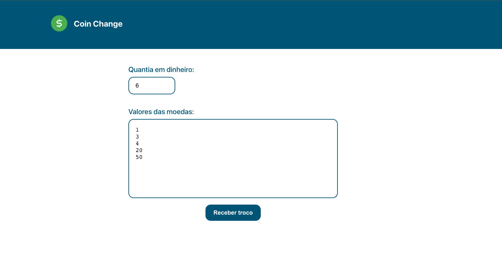
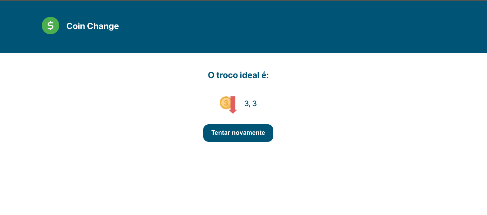

# Coin Change

**Conteúdo da Disciplina**: PD 

## Alunos

| Matrícula  | Aluno                |
| ---------- | -------------------- |
| 15/0005563 | André Lucas Ferreira |
| 17/0039803 | Lucas Medeiros       |

## Sobre

Você fornece uma quantidade de moedas de diferentes valores e uma quantia total de dinheiro. O objetivo do projeto é devolver o menor número de moedas que você precisa para completar esse valor.

Normalmente esse problema pode ser resolvido com um algoritmo ganancioso, mas para esses tipos de solução apenas bases canônicas apresentam uma solução correta, para bases com moedas não canônicas é necessário um algotirmo
baseado em programação dinâmica, como o apresentado nesse trabalho.

Segue a nossa apresentação: [Coin Change](./apresentacao/apresentacao-pd.mp4)

## Screenshots

## Instalação

**Linguagem**: JavaScript, HTML, CSS  
**Framework**: React  

Para clonar o projeto digite:

    git clone https://github.com/projeto-de-algoritmos/PD-Coin-Change

Depois acesse a pasta **coin_change** e rode o comando para executar a aplicação:

    npm start

Por fim, acesse a porta do frontend e aproveite:

    http://localhost:3000/

## Uso

Defina quais são os valores que fazem parte da sua base monetária e defina o valor para cálculo do troco, o programa irá retornar uma lista com as moedas necessárias para o troco
